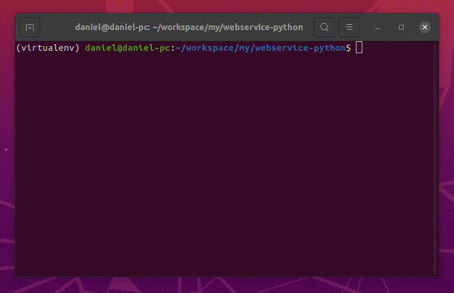

<div align="center">
  
</div>

## webservice-python

[](https://github.com/DanielSchwingel)

<h4 align="center">
  Example application of using webservice with Python
</h4>



## Tecnologies

This project was developed using <b>Python</b> and the library <b>"Requests"</b>, to make requests for an example web service.


- [Python](https://www.python.org/)
- [Requests](https://2.python-requests.org/en/master/)

## 💻 Getting started

### Requirements

- Is recommended to install [virtualenv](https://pypi.org/project/virtualenv/) to run this project.

```bash
$ pip install virtualenv
```

**Clone the project and access the folder**

```bash
$ git clone https://github.com/DanielSchwingel/webservice-python.git && cd webservice-python
```

**Follow the steps below**

```bash
# Create path of virtualenv
$ virtualenv ./virtualenv

# Active virtualenv
$ source ./virtualenv/bin/activate

# After running the application disable virtualenv
$ deactivate

# Install Requests
$ pip install requests

# Run project
$ python temperature.py
```

## 📝 License

This project is licensed under the MIT License - see the [LICENSE](LICENSE) file for details.

---

Made with 💜 by Daniel Filipe Schwingel 👋 [Check out my LinkedIn](https://www.linkedin.com/in/daniel-filipe-schwingel-a6541515b/)
